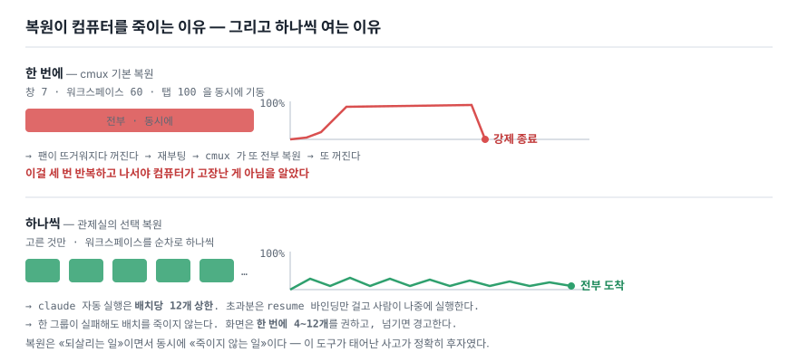

<div align="center">

# cmux Control Room

**When you run dozens of Claude Code sessions at once, this finds the one that is waiting on you —
and brings back what you lost without killing the machine a second time.**

See every window, workspace, group and tab in [cmux](https://cmux.com) — and every Claude Code
session inside them — **on one screen. Rearrange them from there. After a crash, restore only what you pick.**

[한국어](README.md) · [Development history](docs/HISTORY.md) · [cmux field notes](docs/CMUX-NOTES.md)

<br>


<sub>5 windows · 8 groups · 96 workspaces · 85 live Claude tabs.
All synthetic — <code>python run_demo.py</code> gives you this exact screen right now.</sub>

</div>

---

## Why this exists

**① Every open session died.**

It started on 2026-07-02 with a report, not a feature request:

> **"You know those cmux workspaces and tabs I had open? The Claude Code sessions that were
> running in them all died. Can I get them back?"**

Yes — because cmux had **already written `claude --resume <session-id>` to disk** for every tab.
The mapping of which tab was which session was in a file from the start.

**② So we restored them — and this time the restore killed the machine.**

cmux comes back like a browser: **it revives everything that was open.** But this screen had
**7 windows, 60 workspaces and 100 tabs.**

> *"All of it boots at once on restart, so it keeps dying every time it restarts. (…)
> **It happened about three times before I wondered whether the computer was broken** — the fan
> would spin up and it would shut down, and the timing lined up exactly with cmux opening."*

And there is the real starting point of this tool:

> *"If cmux can restore the workspaces, windows, tabs and groups exactly as they were, then
> **that state must be saved somewhere.** Which means **I could restore only the ones I want.**"*

**Restoring everything is what cmux already does. That is the thing that kills you.
What was missing was "only what I pick, without killing the machine."**

<sub>The tool then changed identity three more times — copy-paste table → layout restore (Jul 6) →
always-on monitoring (Aug 22) → cmux control surface (Aug 26). Full story in
<a href="docs/HISTORY.md">the development history</a>.</sub>

---

## It does two jobs

| | What | When you open it |
|---|---|---|
| **① Brings things back** | Return to the moment before the crash and restore **only what you choose** | Force quit, reboot, closed something by mistake |
| **② Finds things for you** | Among dozens of tabs, **the one waiting on you** | All day, left open |

The author considers **①** the more important of the two — *"more important than that, to me, is…"*
So this README starts there too.

---

# ① Bringing things back — recovery

## Snapshots accumulate on their own

It polls every 30 seconds and writes a snapshot **when something changed** — windows, workspaces,
groups and tabs, and also **split ratios and orientation, browser URLs, workspace colours and pins,
and the claude resume command.**

> *"On macOS most people don't shut down — they sleep and wake. But if you keep going long enough,
> **after a week or two you get an unexpected force quit often enough** that I wanted something
> that could put it back right away…"*

Older snapshots get sparser, **but never disappear** — last 7 days in full / hourly to 30 days /
every 4 hours before that / milestones forever. With zlib on top:
**21,284 rows at 2.51 GB → 7,003 rows at 0.25 GB.**

<sub>This came from a report that "old snapshots aren't visible." It wasn't a display problem —
<b>a flat 30-day cut was deleting one day's worth every day.</b> Adding pagination alone would have
produced "you can see everything, and the old ones are already gone."</sub>

## Only what you pick

<div align="center">


</div>

Pick a snapshot and that moment unfolds as **window > group > workspace > tab**. Each workspace's
**minimap** draws the split layout as it was, and the checkboxes nest — a whole window, a group,
a single workspace, or one tab inside it.

> *"That structure comes back exactly — **restore this window, restore just the workspaces,
> restore just the group** — whatever I selected, with Claude auto-start."*

**This is the one tab that was never compacted.** Everywhere else cards collapse to a single line;
here the minimap stays, because *seeing the split layout and choosing from it is the point of this screen*.

- Restore **into a new window or the current one**
- Anything already alive is **filtered out automatically** (claude by *is it running*, browsers by *is that URL open*)
- Restored items are remembered and hidden — **only what is actually gone** stays in the list
- Whatever isn't restored still offers **a copyable `claude --resume`**

## ★ And it does not open them all at once

<div align="center">



</div>

> *"The reason I **deliberately put a pause between them and open them one at a time** is that
> the moment they all open at once, the thing heats up, **CPU usage spikes, and you get lag or
> another force quit.**"*

A restore is **as much about not killing the machine as it is about bringing things back.**
The accident that created this tool was precisely the latter.

| Guard | Value | Why |
|---|---|---|
| Workspace creation | **Sequential** — one at a time | Pouring them in as a batch *is* cmux's default restore |
| claude auto-start | **12 per batch** (`MAX_CLAUDE_AUTORUN`) | One claude process is hundreds of MB. Anything over the cap gets **the resume binding only**, to be started by hand later |
| Older item-level path | cap of 8 | ditto |
| On-screen guidance | **4–12 workspaces at a time**, warns above that | The warning only helps at the moment you're choosing |
| Failure isolation | One group failing **does not kill the batch** | Don't lose the rest because of one |

## It recovers even when the dashboard is down

Every snapshot also writes an **independent backup**.

```bash
cat data/latest-recovery.txt      # human-readable recovery table — resume command per workspace
```

The read and recover paths **work 100% from files alone** — no cmux socket, no running dashboard.
This was settled on day one: **turning on socket control requires restarting cmux, which is
precisely the accident this tool exists to prevent.**

```
read / recover  ← files are enough
   ~/Library/Application Support/cmux/session-*.json   windows, workspaces, splits, resume commands
   ~/.claude/projects/**/*.jsonl                        session labels, last utterance
   ps -E                                                CMUX_PANEL_ID + --session-id
   notification-feed-history-*.json                     Waiting / Permission / Completed

control         ← only when the socket is available (buttons disable otherwise)
   tree --all --json · surface.focus · workspace.group.* · new-workspace --layout
```

---

# ② Finding things for you — monitoring

With five windows and eighty tabs, the question isn't *what is running*.
It's **where is the thing that makes zero progress until I look at it.**

```
permission   Claude is stopped, waiting for my approval. Nothing moves until I look.
             And it is quiet — no output, no progress. If I don't hunt for it I never know.  ← top
question     It asked me something (AskUserQuestion) and is standing there. Same action from me.
running      It's working. I'd like to see it, but it proceeds without me.
background   The turn is done and a shell is still going. When it finishes, someone has to poke it.
waiting      Turn finished, sitting at the prompt. The work is already done.
idle         Quiet.
```

The first two are **"blocked."**

> *"A moment where a tool needs **my permission**, or where **AskUserQuestion has been used and
> it's waiting for my answer** (…) when my intervention is needed **a lock mark appears**, and
> from there I can click straight back into it."*

The header count, the `(4)` in the browser tab title, and the menu-bar badge are all that same sum.
They aren't split into separate numbers for one reason —
**splitting them blurs "how many things are waiting on me right now."**

The definition lives in exactly **one dictionary** in `nav.py`; sort order and the definition of
"blocked" are both derived from it and shipped to clients. If the web UI and the menu-bar app each
wrote their own status list they would **drift silently** — and in fact the web UI's status legend
was running with `question` missing from it.

### Blocked cards catch your eye without being hunted for

<div align="center">


</div>

Motion is **the only channel that reaches you without being looked for**, so it is used here and
nowhere else — this has to be the only thing moving on screen for it to mean anything.

> Four commits went into this one animation. Through the third, "0% stationary" was *measured* and
> declared fixed. But the decay was too steep and the last hop was 1.2px. A keyframe can say
> "in motion" while a human eye reads it as stopped.
> **The test had to be "you can see it move," not "it is moving."** ([the whole story](docs/HISTORY.md))

## 🖥 Menu-bar minimap — so you don't have to open the dashboard

<div align="center">


</div>

The web dashboard is **a place you have to go and look at**, and blocked is **the state you never
learn about unless you hunt for it**. That mismatch is what produced the menu-bar app. If the
bouncing card was an attempt to catch your eye without being hunted for, the badge is an attempt to
**not need the dashboard open at all**.

> *"You can also **see what's running right now, right there in the menu bar.**"*

- **Badge = blocked N.** If nothing is blocked, the running count in green; if only background work
  remains, a gold bolt; otherwise `zzz`.
- **Popover** = status summary + blocked / running / background list (**grouped by cmux group**) +
  click to jump to that tab.
- **It does not decide status.** It only carries what `/api/nav` gave it — including the order and
  the definition of "blocked."

```bash
cd menubar && bash scripts/bundle.sh release && open ./CmuxMinimap.app
# different port:  CMUXMM_PORT=7801 open ./CmuxMinimap.app --args
```

> The app draws only its own status item and talks only to `127.0.0.1` — no TCC, no local-network
> permission, ad-hoc signing is enough. The `.app` bundle is needed for `LSUIElement`, not for
> permissions. See [menubar/README.md](menubar/README.md), which records the measured incident where
> **a full menu bar makes macOS silently push your icon to the far left where the app menu covers it.**

## 🎯 Where am I — which window and which tab

<div align="center">


</div>

One column per window, with the cmux group → workspace → tab hierarchy inside it.
**The active window comes first**, the rest in window order — sorting columns by activity makes the
window you were looking for run away every time something moves. Recency ordering applies
**inside** a column only.

- **The 3px bar on the left** = the workspace colour you painted in cmux — *which piece of work is this*
- **The faint background tint** = status — *is it running, is it waiting for me*
- Idle cards get no tint. Most cards are idle, and colouring those too would mean
  **"being coloured" stops being a signal.**

Expanding a card shows the last human prompt, the evidence behind the status call, cwd, and the
jump button. Prompt extraction keys off **`promptSource`**, not `promptId` — the latter is attached
to tool results too, which empties the preview entirely.

<div align="center">


</div>

### Click a card, land on that tab

<div align="center">


</div>

> *"If I'm looking at this and I click it, I go straight back to that job and answer it (…)
> **I click 'go to this tab' and I'm in that tab**, working."*

A single `surface.focus` does **window switch + workspace switch + tab select** — even for a hidden
workspace in another window. On top of that, `open -a` raises **cmux.app to the front of macOS**.
Without that step the tab has moved but the screen hasn't, so *"it just says it moved and I still
have to go find the window myself."*

The result is **self-verified**. If it doesn't match, you get `didn't move — currently active:
surface:NNN` instead of a success message. Showing only success is how people end up trusting a
screen that is lying.

---

# Everything else

## ✏️ Edit mode — drag to change the real cmux arrangement

<div align="center">


</div>

Drag workspace order, group membership and cross-window moves, hit **apply**, and cmux really
becomes that. Polling stops while editing (reads and writes fight over the same screen).

Undo uses **the same endpoint and the same payload shape** as apply — a dedicated restore path
would be the one that stays under-tested.

cmux lies quietly in three ways here, and all three are handled by **not trusting the response**:

| What cmux does | What the control room does |
|---|---|
| **Silently clamps** the requested index (`--index 8` → 5, output still `OK`) | Compares the planned index on every move, re-reads the whole arrangement at the end, and **returns the mismatches to the screen** |
| Group membership is decided by **contiguous sidebar position**, not by groupId | Position → membership → position, **two passes**. Otherwise the neighbouring group's anchor absorbs your members |
| `after_group_id` — and pinned groups — **return OK without moving** | Compares anchor-workspace indices directly to decide `moved` |

## Current · History · Session health

<table>
<tr>
<td width="33%"><a href="docs/assets/tab-current.png"></a><br><b>Current</b> — live tree joining structure (<code>/api/state</code>) with status (<code>/api/nav</code>), with a copy button for each <code>claude --resume</code>.</td>
<td width="33%"><a href="docs/assets/tab-history.png"></a><br><b>History</b> — the snapshot timeline. Open one and <b>diff it against now</b> to see what disappeared.</td>
<td width="33%"><a href="docs/assets/tab-health.png"></a><br><b>Session health</b> — sessions quiet for a long time, with their memory. <b>There is deliberately no kill button</b> — you read the list and do it in a terminal.</td>
</tr>
</table>

Light/dark is **three states, not two** (`system → light → dark`).
"This site should be light" and "follow the OS" are different statements and weren't merged.

<div align="center">


</div>

---

## Try it in 30 seconds — demo mode

**Works without cmux, and without macOS.** Synthetic state is served in exactly the shape of the
real API, so what renders is the actual `nav.js` and `board.css`. Every screenshot in this README
was taken from it.

```bash
git clone https://github.com/joonlab/cmux-state-dashboard.git
cd cmux-state-dashboard
python3 -m venv .venv && .venv/bin/pip install -r requirements.txt
.venv/bin/python run_demo.py          # → http://localhost:7788
```

In the demo, **dragging actually moves things, pin toggles work, and clicking a card really makes
that tab active** — a read-only demo can't show you what this tool is. `POST /api/demo/reset`
puts it back.

To change what it shows, edit [`demo_fixture.py`](demo_fixture.py) and nothing else — windows,
groups, workspaces and tabs are a list of tuples in there. Times are stored as `ago` seconds and
converted per request, so **"8 seconds ago" is alive whenever you open it.**

> ⚠️ The demo **does not read your cmux, does not touch it, and does not create a database.**

## Pointing it at real cmux

```bash
pm2 start ecosystem.config.js      # → http://localhost:7788
pm2 save                           # survives reboot
```

| Setting | Default | |
|---|---|---|
| `CMUX_DASH_PORT` | `7788` | port |
| `CMUX_DASH_POLL` | `30` | snapshot poll interval (seconds) |
| `CMUX_DASH_DATA` | `./data` | DB and backups |
| `CMUX_DASH_DEMO` | — | `1` for demo mode |

Every tab has its own URL — `/now` `/current` `/history` `/recovery` `/health`, plus `/now/full`
(standalone fullscreen, for a phone or a second monitor). Refresh, bookmark and back all return you
to that tab.

**No hook installation is needed** to map sessions to tabs. cmux sets `CMUX_PANEL_ID`
(= surface UUID) in the environment and passes `--session-id` on the command line, so a single
`ps -E` reads both and joins them against the tree — **exactly, with no guessing.**

### 🧰 Saving a layout to a file, permanently

If the dashboard's snapshots are **a record that accumulates by itself**, this is **naming the
arrangement you have right now and keeping it.** Save it, close the originals to reclaim resources,
and bring it back later exactly as it was.

```bash
python3 tools/cmux-snapshot.py save --label release-work --note "before the v2 deploy"
python3 tools/cmux-snapshot.py restore latest --target new --dry-run
```

The restore engine **reuses the dashboard's `restore.restore_layout_windows()` as is** — two copies
would mean two copies of every bug, and you would only ever fix one. → [tools/README.md](tools/README.md)

---

## Design principles — all of them came from being burned

This is the most reusable part of the repository. Each has its full story in
[the development history](docs/HISTORY.md).

**⚖️ When two sources disagree, pick one as canonical — but never hide the disagreement.**
The socket tree said 4 windows, the native JSON said 2. Choosing native as canonical was correct.
What was wrong is that nothing warned about the gap — and so **a whole window disappeared and nobody knew.**

**🕳 A wrong value makes the user act on it. When you don't know, leave it empty.**
Guessing session-to-tab assignment by title attached one session to two identically-named
workspaces, and the user clicked the wrong tab based on that phantom.

**🖱 A selector click can pass where a human finger is blocked.**
A sticky header (89px) covered cards (110px) and intercepted clicks — but `cmux browser click`
targets the element directly and is immune to occlusion. Automated tests verify *does this element
exist*; a human click verifies *does this point reach this element*. **Those are different claims.**
→ Click verification moved to `elementFromPoint` reachability.

**⏱ Never use file mtime as session activity time.**
A running session's `.jsonl` keeps getting touched with no conversation (median gap **1494 min**
across 45 running sessions, versus **0.3 min** across 2055 finished ones). A session from nine hours
ago showed up at the top as "16 seconds ago." For an append-only log, **size — not mtime — is the
right cache key.**

**🔕 An empty result from a safety guard means no guard at all.**
The double-launch guard parsed `ps` output as text, blew up on a non-UTF-8 byte, and an `except`
swallowed it — so it concluded **"0 running"** and relaunched everything. Parse external command
output as bytes with `errors="replace"`.

**📉 "I can't see it" is not necessarily a UI bug.**
"Old snapshots aren't visible" turned out to be **a flat 30-day cut deleting one day's worth every day.**

**🧯 `max_memory_restart` is a leak backstop, not a throttle on normal peaks.**
150MB limit against a measured 145MB peak — 3% headroom. The app restarted every 30 seconds, and
pm2's SIGINT killed the in-flight cmux child with it, so the screen became "0 tabs and a wall of
warnings." **The limit wasn't the safety net; it was the outage.**

**🎨 Separate the brand layer from the meaning layer.**
Five colours on this screen already carry meaning. Dropping a signature colour on top guarantees a
collision. → Brand lives in text, borders and fills; meaning lives in a 3px bar and small icons.
**They take different forms, so they don't eat each other.** (Same reason: *lines have to be rare for
a line to be a signal.*)

**♿️ Under "reduce motion," slow it down — don't turn it off.**
The spinner was disabled with `animation:none` under `prefers-reduced-motion` and consequently
**had never once spun.** That setting is about large transitions and parallax, not about deleting a
13px progress indicator.

---

## Layout

```
app.py              FastAPI · routes · demo guards
nav.py              "where am I" collection + status decision  ← STATUS_ORDER lives here, once
cmux_client.py      cmux CLI/socket wrapper (incl. password self-heal)
snapshotter.py      normalise · hash · snapshot · independent backup
layout.py           native session JSON → split tree parser
restore.py          faithful layout restore · sequential creation · OOM budget   ← the heart of recovery
claude_index.py     label / cwd / activity extraction from .jsonl
db.py               SQLite (tiered retention · zlib)
demo.py             demo mode — synthetic state in the real API's shape
demo_fixture.py     its data. Edit this alone to change the demo
static/             single-page UI (tokens.css is the only source of colour)
menubar/            Swift menu-bar minimap
tools/              layout archive CLI (shares restore.py)
```

## Requirements

- macOS · [cmux](https://cmux.com) · Python 3.11+
- Control features (focus, restore, rearrange) need cmux socket control enabled
  (`automation.socketControlMode` in `~/.config/cmux/cmux.json`).
  **Viewing and recovery work without the socket.**
- Demo mode needs neither cmux nor macOS.

## Further reading

- **[Development history](docs/HISTORY.md)** — 68 commits from 2026-07-02. The trigger, three
  identity shifts, and the debugging stories. (This repository starts from a single initial commit —
  a few of the original commits carried client and personal names and were not published.)
- **[cmux field notes](docs/CMUX-NOTES.md)** — undocumented cmux behaviour, learned by hitting it.
- **[Menu-bar minimap](menubar/README.md)** — the Swift app and the menu-bar saturation incident.
- **[tools/](tools/README.md)** — the layout archive and restore CLI.

## License

[MIT](LICENSE)

---

> *"If you build this kind of collection setup **for state restoration of a tool you use all the
> time**, then when something unexpected happens you can go back to the environment you had
> backed up and keep using it…"*
>
> <sub>— introducing this tool at Monthly CMDS #20</sub>

<sub>This tool was built with <a href="https://claude.com/claude-code">Claude Code</a>, to manage Claude Code
sessions. Commit messages and code comments carry measured numbers and the traps that were stepped
in, because <b>that is the information you most wish you had when you dig at the same spot again.</b></sub>
