<div align="center">

# cmux 관제실 · cmux Control Room

**Claude Code 세션 수십 개를 동시에 굴릴 때, 지금 나를 기다리는 하나를 찾아 주고,
날아간 것을 죽이지 않고 되살려 주는 도구.**

[cmux](https://cmux.com)의 창·워크스페이스·그룹·탭과 그 안에서 도는 Claude Code 세션을
**한 화면에서 보고, 그 자리에서 손보고, 사고가 나면 원하는 것만 골라 복원한다.**

[English](README.en.md) · [개발사(史)](docs/HISTORY.md) · [cmux 실측 노트](docs/CMUX-NOTES.md)

<br>

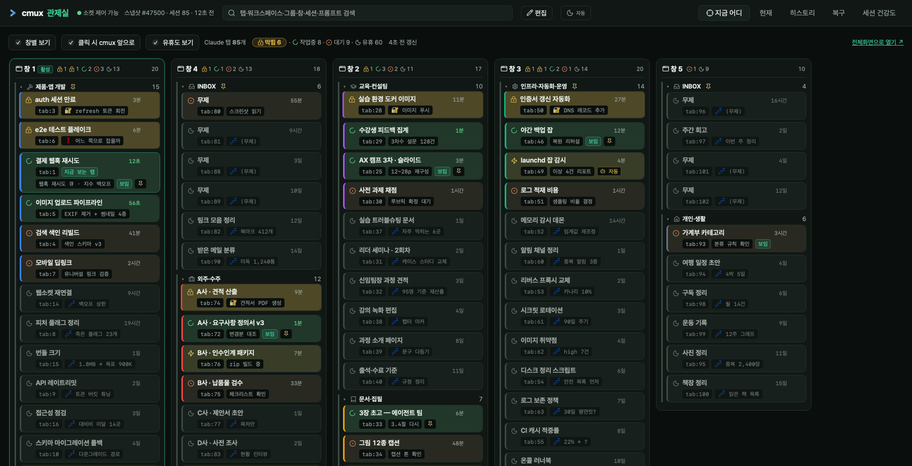

<sub>창 5개 · 그룹 8개 · 워크스페이스 96개 · 살아 있는 Claude 탭 85개.
모두 데모 모드의 합성 데이터입니다 — <code>python run_demo.py</code> 로 지금 바로 같은 화면을 띄울 수 있습니다.</sub>

</div>

---

## 왜 만들었나

**① 열려 있던 세션이 다 날아갔다.**

2026년 7월 2일, 도구 요청이 아니라 사고 신고에서 시작했다.

> **"지금 cmux 워크스페이스와 탭들 열려있는 거 있잖아. 이거 전에 claude code 세션 열려있던 게
> 다 꺼져버렸는데 그거 복구 가능해?"**

복구는 됐다. cmux가 탭마다 `claude --resume <세션ID>`를 **이미 디스크에 적어 두고 있었기** 때문이다.
어느 탭이 어느 세션이었나의 매핑이 처음부터 파일에 있었다.

**② 그래서 복원했더니, 이번엔 복원이 컴퓨터를 죽였다.**

cmux는 브라우저처럼 **꺼졌던 걸 전부 되살리며 켜진다.** 그런데 이 화면에는
**창 7개 · 워크스페이스 60개 · 탭 100개**가 있었다.

> *"이것들이 한 번에 쫙 재부팅되면서 켜지다 보니까 재부팅될 때마다 계속 꺼지는 거예요. (…)
> **이게 한 세 번 반복됐다가 컴퓨터 망가졌나 했는데**, cmux가 갑자기 계속 팬이 뜨거워지면서
> 돌아가다가 꺼지는 게 cmux가 열리면서 꺼지는 타이밍이 똑같다 보니까…"*

여기서 이 도구의 진짜 출발점이 나온다.

> *"cmux가 워크스페이스와 윈도우, 탭, 그룹 이런 구조를 그대로 복원할 수 있다는 건
> **그런 상태들이 계속 저장이 돼 있다는 거겠구나.** 그러면 이거를 **내가 원하는 것만
> 복원시키는 작업도 가능하겠네.**"*

**전부 되살리는 건 이미 cmux가 한다. 그게 사람을 죽인다.
필요한 건 「고른 것만, 죽이지 않고」였다.**

<sub>그 뒤로 도구의 정체는 세 번 더 바뀌었다 — 복붙표 → 레이아웃 복원(7/6) → 상시 관제(8/22) →
cmux 제어면(8/26). 전말은 <a href="docs/HISTORY.md">개발사(史)</a>에.</sub>

---

## 이 도구는 두 가지 일을 한다

| | 무엇 | 언제 여나 |
|---|---|---|
| **① 되살린다** | 사고 직전 상태로 돌아가 **원하는 것만** 복원 | 강제 종료·재부팅·실수로 닫았을 때 |
| **② 찾아 준다** | 수십 개 탭 중 **지금 나를 기다리는 것** | 하루 종일, 띄워 놓고 |

만든 사람이 더 중요하게 여기는 쪽은 **①**이다 — *"그것보다 저는 더 중요하게 여기는 게…"*
그래서 여기서도 ①부터 쓴다.

---

# ① 되살린다 — 복구

## 스냅샷은 알아서 쌓인다

30초마다 폴링하고 **변화가 있을 때** 스냅샷을 남긴다. 창·워크스페이스·그룹·탭은 물론
**스플릿 분할비율·방향, 브라우저 URL, 워크스페이스 색·고정, claude resume 명령**까지 통째로.

> *"macOS 같은 경우에는 대부분 종료시키지 않고 잠자기 모드를 한 다음에 다시 켜서 활동을 하는데,
> 작업을 너무 오래 지속하다 보면 **일주일, 이주일 되다가 갑자기 강제 종료되는 경우가
> 심심치 않게 일어나서** 그 부분을 바로 복구할 수 있는…"*

오래될수록 성기게, **대신 영원히** 남긴다 — 최근 7일 전부 / 30일까지 시간당 1개 /
그 이전 4시간당 1개 / 마일스톤은 영구. zlib 압축까지 더해 **21,284건 2.51GB → 7,003건 0.25GB.**

<sub>이건 "옛 스냅샷이 안 보인다"는 신고에서 나왔다. 표시 문제가 아니라 <b>30일 평면 컷이 매일
하루치씩 지우고 있었다.</b> 페이지네이션만 붙였다면 "다 보이긴 하는데 옛날 건 이미 없는" 상태가 됐다.</sub>

## 원하는 것만 골라서

<div align="center">

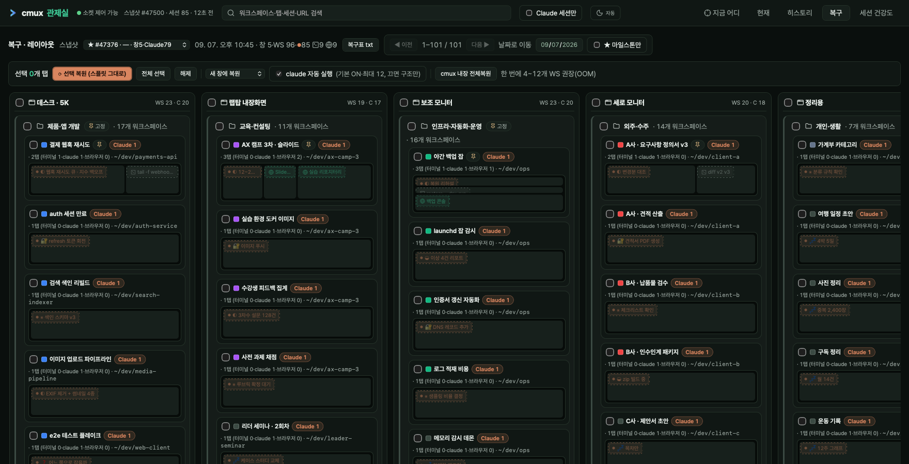

</div>

스냅샷을 고르면 그 시점의 배치가 **창 > 그룹 > 워크스페이스 > 탭**으로 펼쳐진다.
각 워크스페이스의 **미니맵**이 스플릿 배치를 그대로 그려 주고, 체크박스는 다단계다 —
창 전체 / 그룹만 / 워크스페이스만 / 그 안의 탭 하나까지.

> *"그때의 구조가 그대로 **이 창을 복원하는 거, 워크스페이스만 복원하는 거, 그룹만 복원하는 거**,
> 내가 선택한 것들을 Claude 자동 실행 복원을 통해서 이제 해볼 수가 있고요."*

**이 탭만 압축하지 않았다.** 다른 화면은 카드를 한 줄로 접었지만 여기는 미니맵을 살려 뒀다 —
*분할 배치를 눈으로 보고 고르는 게 이 화면의 목적*이라서.

- **새 창에 복원 / 현재 창에 복원** 을 고를 수 있다
- 이미 살아 있는 건 **자동으로 걸러진다**(claude는 «실행 중인가», 브라우저는 «그 URL이 열려 있나»)
- 복원한 항목은 기록해 두고 목록에서 숨긴다 — **실제로 사라진 것만** 남는다
- 복원 못 한 것도 **`claude --resume` 명령을 복사**할 수 있다

## ★ 그리고 한 번에 열지 않는다

<div align="center">

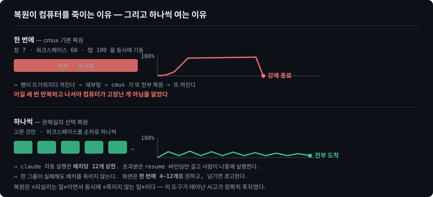

</div>

> *"이게 제가 **일부러 중간중간 그 휴식을 두고 하나씩 열릴 수 있게 한 이유**가,
> 한 번에 팍 열리게 하는 순간 얘가 갑자기 달아오르면서 **CPU 사용률이 확 올라가면서
> 렉이 걸린다든지 아니면 강제 종료가 된다든지** 하는 경우가 생기더라고요."*

복원은 **되살리는 일이면서 동시에 죽이지 않는 일**이다. 이 도구를 만들게 한 사고가 정확히 후자였다.

| 장치 | 값 | 왜 |
|---|---|---|
| 워크스페이스 생성 | **순차** — 한 번에 하나씩 | 배치로 한꺼번에 부으면 그게 곧 cmux 기본 복원이다 |
| claude 자동 실행 | **배치당 12개 상한** (`MAX_CLAUDE_AUTORUN`) | claude 프로세스 하나가 수백 MB다. 초과분은 **resume 바인딩만** 걸어 두고 사람이 나중에 실행 |
| 항목 단위 옛 경로 | 8개 상한 | 〃 |
| 화면 안내 | **한 번에 4~12개 권장**, 넘기면 경고 | 고르는 순간에 알려 줘야 의미가 있다 |
| 실패 격리 | 한 그룹이 실패해도 **배치를 죽이지 않는다** | 하나 때문에 나머지를 잃지 않게 |

## 대시보드가 죽어 있어도 복구된다

매 스냅샷마다 **독립 백업**을 따로 쓴다.

```bash
cat data/latest-recovery.txt      # 사람이 읽는 복구표 — 워크스페이스별 resume 명령
```

읽기·복구 경로는 **파일만 있으면 100% 동작한다.** cmux 소켓이 없어도, 대시보드가 안 떠 있어도.
이건 첫날 정해진 원칙이다 — **소켓 제어를 켜려면 cmux를 재시작해야 하는데,
그게 바로 이 도구가 막으려는 사고였기 때문이다.**

```
읽기·복구  ← 파일만 있으면 된다
   ~/Library/Application Support/cmux/session-*.json   창·워크스페이스·스플릿·resume 명령
   ~/.claude/projects/**/*.jsonl                        세션 라벨·마지막 발화
   ps -E                                                CMUX_PANEL_ID + --session-id
   notification-feed-history-*.json                     Waiting / Permission / Completed

제어      ← 소켓이 있을 때만 (없으면 버튼만 비활성)
   tree --all --json · surface.focus · workspace.group.* · new-workspace --layout
```

---

# ② 찾아 준다 — 관제

창 다섯 개에 탭이 여든 개면, 문제는 "무엇이 돌고 있나"가 아니다.
**내가 안 보면 0이 진행되는 탭이 어디 있나**다.

```
permission   Claude 가 내 승인을 기다리며 멈춰 있다. 내가 안 보면 0이 진행된다.
             게다가 조용하다 — 출력도 진행도 없어서 안 찾으면 영영 모른다.  ← 최우선
question     AskUserQuestion 으로 물어보고 서 있다. 내가 할 행동이 permission 과 같다.
running      돌고 있다. 보고 싶지만 내가 없어도 진행된다.
background   답은 끝났고 뒤에서 셸이 돈다. 끝나면 한 번 찔러 줘야 다음이 이어진다.
waiting      턴이 끝나 프롬프트에 서 있다. 일은 이미 끝난 상태다.
idle         조용하다.
```

앞의 둘이 **「막힘」이다.**

> *"어떤 툴을 사용하다가 **저의 허가를 받아야 되는 장면**이나, **AskUserQuestion이라는 툴이
> 사용돼서 저의 답을 기다리고 있는 상황** (…) 저의 어떤 개입이 필요한 순간에는
> **잠금 표시가 뜨면서** 그 상태로 클릭하면 바로 돌아갈 수가 있거든요."*

헤더의 숫자도, 브라우저 탭 제목의 `(4)`도, 메뉴바 배지도 전부 이 합이다.
숫자를 나누지 않는 이유는 하나다 — **나누면 "지금 나를 기다리는 게 몇 개냐"가 흐려진다.**

정의는 서버의 `nav.py` 딕셔너리 **하나**에만 있고, 정렬 순서도 '막힘'의 정의도 전부 거기서 파생돼
클라이언트로 내려간다. 웹과 메뉴바가 각자 상태 목록을 적으면 **소리 없이 어긋나기 때문이다**
(실제로 웹의 상태 점 목록이 `question`을 빠뜨린 채 돌고 있었다).

### 막힌 카드는 안 찾아도 눈에 걸린다

<div align="center">


</div>

움직임은 **안 찾아도 눈에 걸리는 유일한 채널**이라 여기에만 쓴다 —
화면에서 움직이는 게 이것뿐이어야 이것이 신호가 된다.

> 이 애니메이션 하나에 커밋 네 개가 들어갔다. 세 번째까지는 "정지 구간 0%"를 측정해 해결했다고
> 봤는데, 감쇠가 가팔라 마지막 뜀이 1.2px였다. 키프레임상 '움직이는 중'이어도 사람 눈엔 정지다.
> **기준은 '움직이고 있다'가 아니라 '움직이는 게 보인다'여야 했다.** ([전말](docs/HISTORY.md#막힘-강조-4번의-반복))

## 🖥 메뉴바 미니맵 — 대시보드를 열지 않아도 된다

<div align="center">

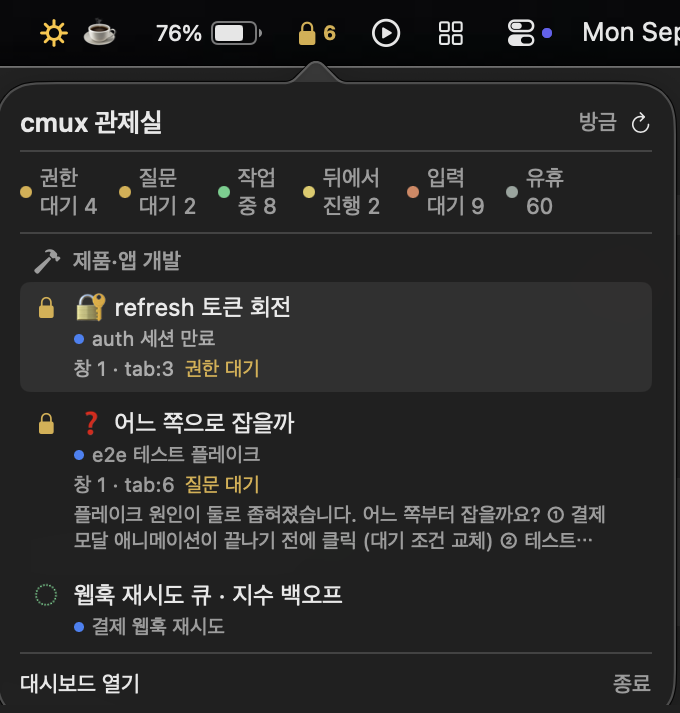

</div>

웹 대시보드는 **보러 가야 하는 곳**이고, 막힘은 **안 찾으면 영영 모르는** 상태다.
그 어긋남이 메뉴바 앱을 낳았다. 통통 튀는 카드가 "안 찾아도 눈에 걸리게" 하는 시도였다면,
메뉴바 배지는 **애초에 대시보드를 열지 않아도 되게** 하는 시도다.

> *"이런 것들을 **메뉴바에서 이렇게 지금 바로 돌아가는 걸 볼 수도 있고요.**"*

- **배지 = 막힘 N.** 막힘이 없으면 작업중 수를 초록으로, 뒤에서만 돌면 금색 번개, 그것도 없으면 `zzz`.
- **팝오버** = 상태 요약 + 막힘·작업중·뒤에서 진행 목록(**cmux 그룹으로 묶음**) + 클릭 시 그 탭으로 점프.
- **상태 판정을 하지 않는다.** `/api/nav`가 준 것을 옮겨 담기만 한다 — 순서도 '막힘'의 정의도 서버 값을 쓴다.

```bash
cd menubar && bash scripts/bundle.sh release && open ./CmuxMinimap.app
# 포트가 다르면:  CMUXMM_PORT=7801 open ./CmuxMinimap.app --args
```

> 이 앱은 자기 status item만 그리고 `127.0.0.1`에만 말을 건다 — TCC도 로컬 네트워크 권한도
> 필요 없고 ad-hoc 서명으로 충분하다. `.app` 번들이 필요한 이유는 권한이 아니라 `LSUIElement`다.
> 자세한 건 [menubar/README.md](menubar/README.md) — **메뉴바가 꽉 차면 macOS가 아이콘을
> 화면 왼쪽 끝으로 조용히 밀어내고 앱 메뉴가 그걸 덮는다**는 실측 사고 기록이 거기 있다.

## 🎯 지금 어디 — 어느 창의 어느 탭인지

<div align="center">

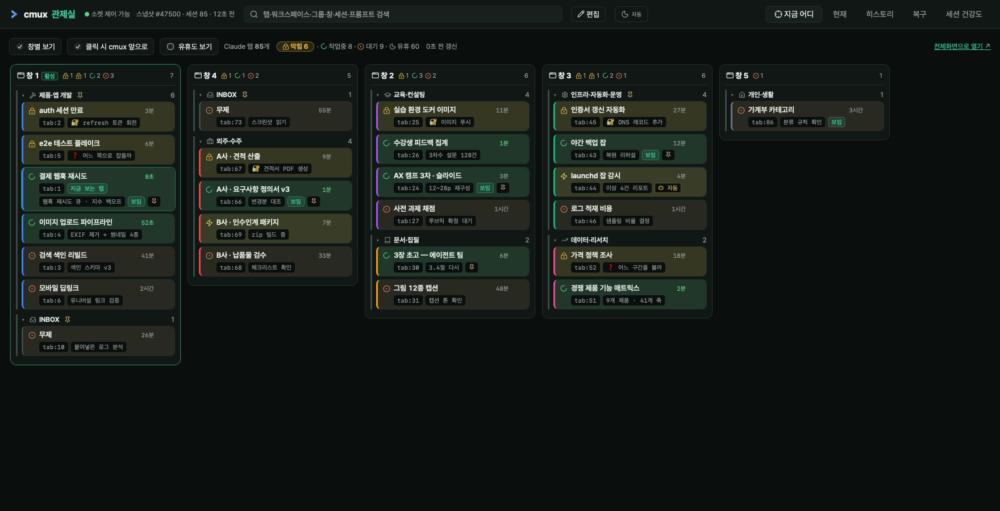

</div>

창 하나가 컬럼 하나다. 그 안에 cmux 그룹 → 워크스페이스 → 탭 위계가 그대로 들어간다.
**활성 창이 맨 앞**, 나머지는 창 번호순 — 활동순으로 하면 방금 움직인 창이 계속 자리를 바꿔
찾던 창이 도망간다. 컬럼 **안에서만** 최근 활동순이다.

- **왼쪽 3px 띠** = cmux에서 사람이 칠해 둔 워크스페이스 색 — *이게 어느 일이냐*
- **배경 옅은 물듦** = 상태 — *지금 돌고 있나, 나를 기다리나*
- 유휴에는 물을 들이지 않는다. 대부분이 유휴라 거기까지 칠하면 **'칠해진 것'이 신호가 못 된다.**

카드를 열면 마지막 사람 프롬프트·상태 근거·cwd·이동 버튼이 나온다.
프롬프트 추출은 `promptId`가 아니라 **`promptSource`** 기준이다 — 전자는 tool_result에도 붙어
미리보기가 통째로 빈다.

<div align="center">

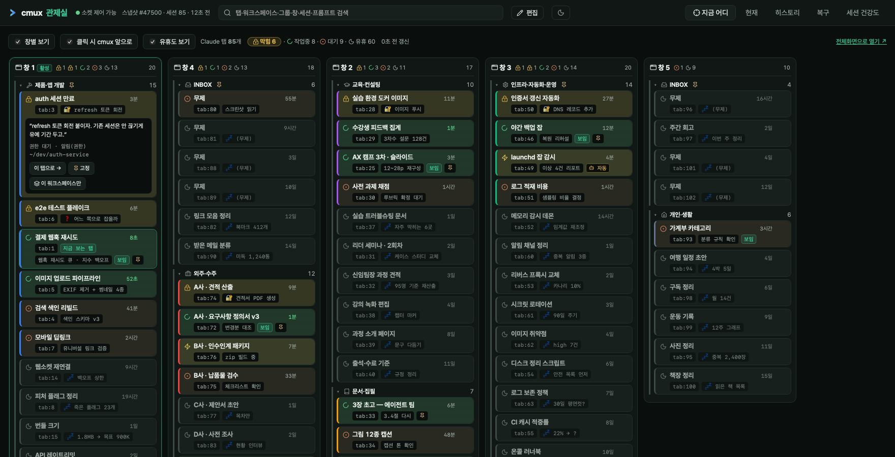

</div>

### 카드를 누르면 그 탭으로 간다

<div align="center">

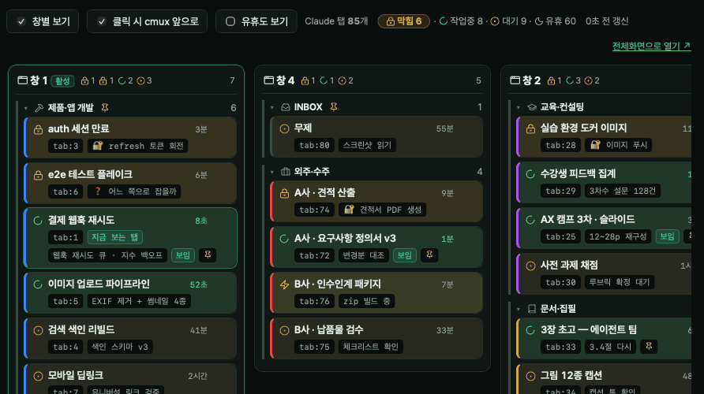

</div>

> *"제가 이걸 보고 있다가 이거를 클릭하면 그 작업을 바로 돌아가서 제가 답을 할 수 있도록 (…)
> **「이 탭으로」라고 클릭하면 해당 탭으로 들어가서** 작업을 할 수 있게."*

`surface.focus` 한 번으로 **창 전환 + 워크스페이스 전환 + 탭 선택**이 전부 된다 — 다른 창의
숨은 워크스페이스라도. 여기에 `open -a`로 **cmux.app을 macOS 최전면까지** 끌어올린다.
그게 없으면 탭은 옮겨졌는데 화면은 그대로라 *"이동했다는 말만 뜨고 내가 직접 창을 찾아야"* 한다.

이동 결과는 **자기 검증**한다. 어긋나면 성공 문구 대신 `이동 안 됨 — 지금 활성: surface:NNN`이
뜬다. 성공 문구만 띄우면 사용자가 화면을 믿고 또 헤맨다.

---

# 그 밖에

## ✏️ 편집 모드 — 끌어서 실제 cmux 배치를 바꾼다

<div align="center">

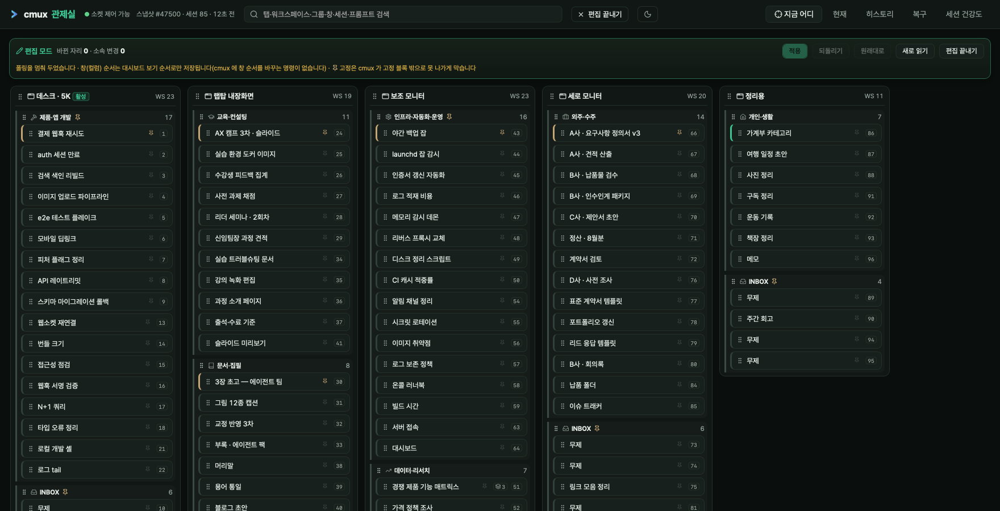

</div>

워크스페이스 순서·그룹 소속·창 간 이동을 끌어서 바꾸고 **적용**하면 진짜 cmux가 그렇게 된다.
편집 중엔 폴링을 멈춘다(읽기와 쓰기가 같은 화면에서 싸운다).

되돌리기는 **적용과 같은 엔드포인트·같은 payload**를 쓴다. 복원 전용 경로를 두면 그쪽만
덜 검증된 채 남기 때문이다.

여기서 cmux가 조용히 거짓말하는 것 셋을 만났고, 셋 다 **응답을 믿지 않고 대조해서** 다룬다:

| cmux 가 하는 일 | 관제실이 하는 일 |
|---|---|
| 요청 인덱스를 **조용히 클램프**한다 (`--index 8` → 5인데 출력은 `OK`) | 이동마다 계획 인덱스를 대조하고, 끝나면 배치를 통째로 다시 읽어 `mismatches`를 **화면에 돌려준다** |
| 그룹 멤버십이 groupId가 아니라 사이드바 **연속 위치**로 정해진다 | 위치 → 소속 → 위치 **2패스**. 안 그러면 옆 그룹 앵커가 멤버를 흡수한다 |
| `after_group_id`도, 고정된 그룹도 **안 움직이면서 OK만** 준다 | 앵커 워크스페이스 인덱스를 직접 대조해 `moved`를 판정한다 |

## 현재 · 히스토리 · 세션 건강도

<table>
<tr>
<td width="33%"><a href="docs/assets/tab-current.png">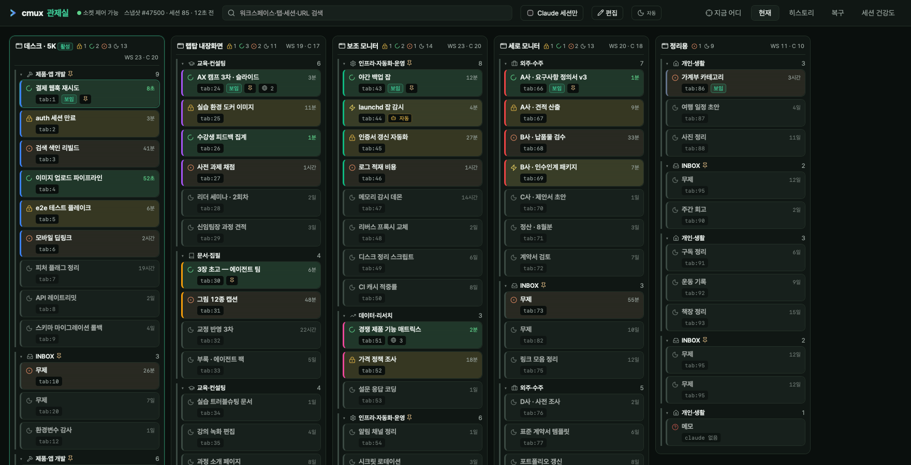</a><br><b>현재</b> — 구조(<code>/api/state</code>)에 상태(<code>/api/nav</code>)를 조인한 라이브 트리. 워크스페이스마다 <code>claude --resume</code> 복사.</td>
<td width="33%"><a href="docs/assets/tab-history.png">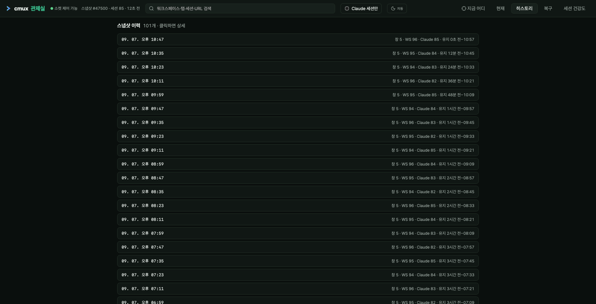</a><br><b>히스토리</b> — 쌓인 스냅샷 타임라인. 열어 보고 <b>현재와 diff</b> 해서 무엇이 사라졌는지 본다.</td>
<td width="33%"><a href="docs/assets/tab-health.png">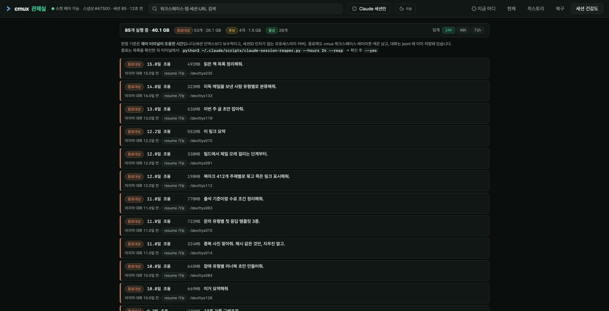</a><br><b>세션 건강도</b> — 조용한 지 오래된 세션을 메모리와 함께. <b>종료 버튼은 일부러 두지 않았다</b> — 목록을 보고 사람이 터미널에서 한다.</td>
</tr>
</table>

라이트/다크는 **둘이 아니라 셋**이다(`system → light → dark`).
"이 사이트는 밝게"와 "OS를 따라가라"는 다른 뜻이라 하나로 합치지 않았다.

<div align="center">

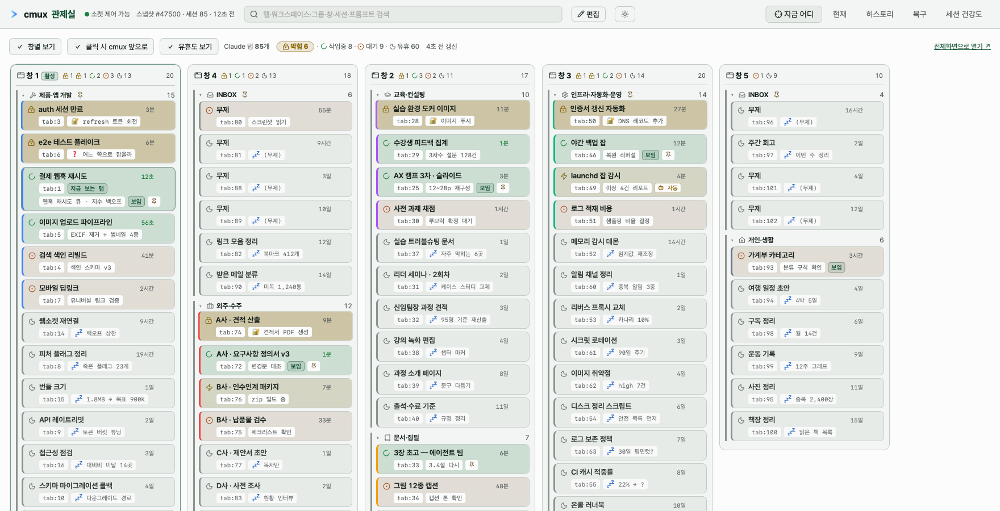

</div>

---

## 30초 만에 해 보기 — 데모 모드

**cmux가 없어도, macOS가 아니어도 돌아간다.** 합성 상태를 실제 API와 똑같은 모양으로 내려 주므로
화면에 그려지는 건 진짜 `nav.js`·`board.css`다. 이 README의 스크린샷도 전부 여기서 찍었다.

```bash
git clone https://github.com/joonlab/cmux-state-dashboard.git
cd cmux-state-dashboard
python3 -m venv .venv && .venv/bin/pip install -r requirements.txt
.venv/bin/python run_demo.py          # → http://localhost:7788
```

데모에서도 **끌어다 놓으면 실제로 옮겨지고, 고정 토글도 먹고, 카드를 누르면 그 탭이 활성이 된다.**
읽기만 되는 데모는 이 도구가 무엇인지 못 보여주기 때문이다. 흐트러뜨렸으면
`POST /api/demo/reset` 으로 되돌린다.

내용을 바꾸고 싶으면 [`demo_fixture.py`](demo_fixture.py) 하나만 고치면 된다 —
창·그룹·워크스페이스·탭이 튜플 목록으로 들어 있다. 시각은 `ago`(초)로만 적어 두고 요청 때
환산하므로 **언제 열어도 "8초 전"이 살아 있다.**

> ⚠️ 데모는 **이 기계의 cmux를 읽지도, 건드리지도, DB를 만들지도 않는다.**

## 진짜 cmux에 붙이기

```bash
pm2 start ecosystem.config.js      # → http://localhost:7788 (상시)
pm2 save                           # 재부팅 생존
```

| 설정 | 기본값 | |
|---|---|---|
| `CMUX_DASH_PORT` | `7788` | 포트 |
| `CMUX_DASH_POLL` | `30` | 스냅샷 폴링 주기(초) |
| `CMUX_DASH_DATA` | `./data` | DB·백업 위치 |
| `CMUX_DASH_DEMO` | — | `1`이면 데모 모드 |

탭마다 고유 URL을 가진다 — `/now` `/current` `/history` `/recovery` `/health`,
그리고 `/now/full`(단독 전체화면·폰이나 보조 모니터에 띄워두는 용도).
새로고침·북마크·뒤로가기가 그 탭으로 돌아온다.

세션 ↔ 탭 매핑에 **훅을 설치할 필요가 없다.** cmux가 claude를 띄울 때 환경변수
`CMUX_PANEL_ID`(= surface UUID)를 심고 명령줄에 `--session-id`가 들어가므로, `ps -E` 한 번으로
둘을 같이 읽어 트리와 조인하면 **추측 없이** 정확하다.

### 🧰 레이아웃을 파일로 영구 저장하기

대시보드의 스냅샷이 **자동으로 쌓이는 기록**이라면, 이건 **지금 이 배치에 이름을 붙여 보관**하는 쪽이다.
저장한 뒤 원본을 닫아 리소스를 회수하고, 나중에 그대로 되살린다.

```bash
python3 tools/cmux-snapshot.py save --label 릴리스작업 --note "v2 배포 전 상태"
python3 tools/cmux-snapshot.py restore latest --target new --dry-run
```

복원 엔진은 대시보드의 `restore.restore_layout_windows()` 를 **그대로 재사용한다** —
두 벌이 되면 버그도 두 벌이 되고 한쪽만 고치게 되기 때문이다. → [tools/README.md](tools/README.md)

---

## 설계 원칙 — 사고에서 나온 것들

이 저장소에서 가장 재사용 가치가 큰 부분이다. 전부 실제로 데인 자리에서 나왔다.
[개발사(史)](docs/HISTORY.md)에 각각의 전말이 있다.

**⚖️ 두 소스가 어긋나면 한쪽을 정본으로 삼되, 불일치는 반드시 드러내라.**
소켓 트리는 창 4개, 네이티브 JSON은 2개였다. 정본을 native로 통일한 것 자체는 옳았다.
틀린 건 어긋났는데 경고가 없었다는 점이고, 그래서 **창 하나가 통째로 사라진 걸 아무도 몰랐다.**

**🕳 틀린 값을 채우면 사용자가 그걸 근거로 잘못 판단한다 — 모르면 비운다.**
제목 추측으로 세션을 배정했더니 같은 이름의 워크스페이스 두 곳에 한 세션이 붙었고,
사용자는 그 허상을 근거로 엉뚱한 탭을 눌렀다.

**🖱 셀렉터 클릭이 통과해도 사람 손에서는 막힐 수 있다.**
sticky 헤더(89px)가 카드(110px)를 덮어 클릭을 가로챘는데, `cmux browser click` 은 셀렉터로
직접 클릭해 가림과 무관하다. 자동 테스트는 *요소가 존재하는가*를 검증하고, 사람의 클릭은
*그 지점이 이 요소에 도달하는가*를 검증한다. **둘은 다른 명제다.**
→ 클릭 검증 기준을 `elementFromPoint` 도달 여부로 바꿨다.

**⏱ 세션 활동 시각에 파일 mtime 을 쓰지 마라.**
실행 중인 세션의 `.jsonl` 은 대화가 없어도 계속 touch된다(실행 중 45개의 괴리 중앙값 **1494분**,
종료된 2055개는 **0.3분**). 9시간 전 세션이 "16초 전"으로 최상단에 떴다.
append-only 로그라 **캐시 키도 mtime 이 아니라 size** 가 맞다.

**🔕 안전가드의 빈 결과 = 가드 없음.**
이중기동 가드가 `ps` 출력을 텍스트로 읽다 비-UTF8 바이트에서 터졌고, `except` 가 그걸 삼켜
**"실행 중 0개"로 오판**해 전부 다시 띄웠다. 외부 명령 파싱은 bytes + `errors="replace"` 로.

**📉 "안 보인다"는 신고에 UI부터 고치지 마라.**
"옛 스냅샷이 안 보인다" → 표시 문제가 아니라 **30일 평면 컷이 매일 하루치씩 지우고 있었다.**

**🧯 `max_memory_restart` 는 누수 백스톱이지 정상 피크를 조이는 장치가 아니다.**
한도 150MB에 실측 피크 145MB — 여유 3%. 앱이 30초마다 재시작됐고, pm2가 SIGINT를 보낼 때
진행 중이던 cmux 자식이 같이 죽어 화면이 "탭 0개 + 경고 벽"이 됐다.
**한도가 안전장치가 아니라 장애 원인이었다.**

**🎨 브랜드층과 의미층을 가른다.**
이 화면엔 색 다섯 개가 이미 뜻을 지고 있다. 시그니처 하나를 그냥 얹으면 반드시 충돌한다.
→ 브랜드는 글자·테두리·채움으로, 의미는 3px 선과 작은 아이콘으로. **나타나는 모양이 달라서
한 화면에 있어도 서로를 잡아먹지 않는다.** (같은 이유로 "선이 드물어야 선이 신호가 된다")

**♿️ 「동작 줄이기」에서 끄지 말고 늦춰라.**
`prefers-reduced-motion` 에서 스피너를 `animation:none` 으로 껐더니 **한 번도 돈 적이 없었다.**
그 설정의 취지는 큰 화면 전환을 줄이라는 것이지 13px짜리 진행 표시를 없애라는 게 아니다.

---

## 구조

```
app.py              FastAPI · 라우트 · 데모 가드
nav.py              '지금 어디' 수집 + 상태 판정  ← STATUS_ORDER 가 여기 하나뿐이다
cmux_client.py      cmux CLI/소켓 래퍼 (비번 self-heal 포함)
snapshotter.py      정규화·해시·스냅샷·독립 백업
layout.py           네이티브 세션 JSON → 스플릿 트리 파서
restore.py          레이아웃 충실 복원 · 순차 생성 · OOM 예산   ← 복구의 심장
claude_index.py     .jsonl 라벨/cwd/활동 추출
db.py               SQLite (계층적 보존 · zlib 압축)
demo.py             데모 모드 — 합성 상태를 실제 API 모양으로
demo_fixture.py     ↑ 의 데이터. 여기만 고치면 데모 내용이 바뀐다
static/             단일 페이지 UI (tokens.css 가 색의 유일한 정본)
menubar/            Swift 메뉴바 미니맵
tools/              레이아웃 영구 저장 CLI (restore.py 공유)
```

## 요구사항

- macOS · [cmux](https://cmux.com) · Python 3.11+
- 제어 기능(포커스·복원·재배치)은 cmux 소켓 제어가 켜져 있어야 한다
  (`~/.config/cmux/cmux.json` 의 `automation.socketControlMode`).
  **조회·복구는 소켓 없이도 동작한다.**
- 데모 모드는 cmux도 macOS도 필요 없다.

## 더 읽을 것

- **[개발사(史)](docs/HISTORY.md)** — 2026-07-02부터 68커밋. 계기·세 번의 성격 전환·디버깅 서사.
  (저장소 이력은 초기 커밋 하나로 시작한다 — 원래 커밋 몇 개에 고객사명·실명이 있어 공개하지 않았다.)
- **[cmux 실측 노트](docs/CMUX-NOTES.md)** — 문서에 없어서 직접 부딪혀 알아낸 cmux 내부 동작 모음.
- **[메뉴바 미니맵](menubar/README.md)** — Swift 앱과 메뉴바 포화 사고.
- **[tools/](tools/README.md)** — 레이아웃 영구 저장·복원 CLI.

## 라이선스

[MIT](LICENSE)

---

> *"여러분들이 **내가 자주 사용하는 어떤 툴에 대한 상태 복원 같은 거에도 이런 수집 환경을
> 미리 구축을 해둔다면**, 내가 예기치 못한 어떤 그런 문제가 생겼을 때 그 환경을 바로
> 백업해둔 상태로 돌아가서 내가 활용할 수 있게끔…"*
>
> <sub>— 「월간 CMDS」 20회차에서, 이 도구를 소개하며</sub>

<sub>이 도구는 <a href="https://claude.com/claude-code">Claude Code</a> 로 만들어졌고, 그 Claude Code 세션을
관리하기 위해 만들어졌다. 커밋 메시지와 코드 주석에 실측값과 밟은 함정이 남아 있는 이유는
<b>나중에 같은 자리를 다시 팔 때 그게 제일 아쉬운 정보</b>라서다.</sub>
